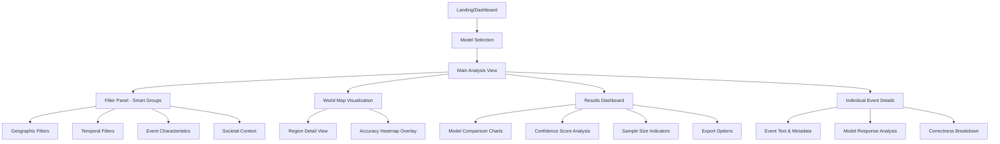
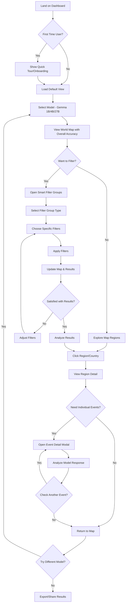
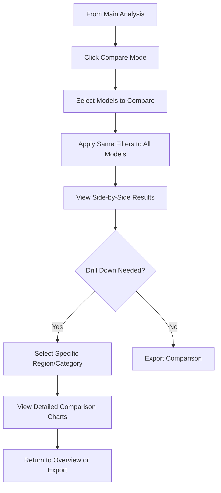

# Gemma Hallucination Visualizer - Front-End Specification

**Project:** gemma-hallu-visualizer  
**Version:** 1.0  
**Date:** 2025-08-03  
**Author:** UX Expert (Sally)

---

## 1. Introduction & UX Goals

### 🎯 UX Goals & Principles

**Primary Goals:**
1. **Model Comparison Interface** - Easy selection between Gemma 1B, 4B, and 27B models
2. **Geographic Visualization** - World map showing correct/incorrect regional performance
3. **Multi-dimensional Filtering** - Interactive filters for all categorical parameters
4. **Accuracy Pattern Discovery** - Visual patterns in model hallucinations across dimensions
5. **Future Extensibility** - Architecture ready for subcategory expansion

**Target User Personas:**
- **AI Researchers** - Analyzing model bias and accuracy patterns
- **Data Scientists** - Exploring correlations between parameters and accuracy
- **Geographic Bias Analysts** - Studying regional knowledge disparities

### 🎯 Smart Filter Architecture

**Progressive Filter Groups:**

1. **📍 Geographic Filters**
   - Select: "Geographic Analysis" → Shows: Continental, Cultural Region
   - Smart logic: Selecting continent pre-filters cultural regions

2. **⏰ Temporal Filters**  
   - Select: "Time Period Analysis" → Shows: Century, Decade, Historical Period
   - Smart logic: Selecting century auto-populates relevant decades

3. **🏛️ Event Characteristics**
   - Select: "Event Properties" → Shows: Primary Category, Violence Level, Scale, Human Impact
   - Smart logic: Categories can suggest typical violence levels

4. **🌍 Societal Context**
   - Select: "Societal Factors" → Shows: Development Status, Colonial Status, Seasonal
   - Smart logic: Colonial status correlates with development status suggestions

**Smart UI Behaviors:**
- **Progressive Disclosure**: Start with 4 main filter groups, expand on selection
- **Contextual Suggestions**: Pre-populate related filters based on selections
- **Visual Hierarchy**: Active filter groups highlighted, inactive ones minimized
- **Quick Reset**: Easy "Clear Group" or "Clear All" options
- **Filter Memory**: Remember commonly used combinations

---

## 2. Information Architecture

### 🏗️ Site Map & Screen Structure



### 📱 Screen Inventory

**Core Screens:**
1. **Dashboard/Landing** - Model overview, quick stats, getting started
2. **Main Analysis Interface** - Primary working view with map + filters + results
3. **Model Comparison View** - Side-by-side analysis of multiple models
4. **Event Detail Modal** - Deep dive into individual prediction results
5. **Export/Settings Panel** - Data export, visualization preferences

---

## 3. User Flows

### 🔄 Primary User Flow: Model Analysis



### 🔄 Secondary User Flow: Model Comparison



### ⚡ Edge Cases & Error Handling

**Data Loading States:**
- **Initial Load**: Skeleton screens for map and dashboard
- **Filter Application**: Loading overlay with progress indicator
- **Model Switching**: Smooth transition with data preservation where possible

**Empty/No Results States:**
- **No Data for Filter Combination**: Suggest alternative filters
- **Model Data Missing**: Clear messaging with fallback options
- **Network Issues**: Offline indicator with retry options

**User Error Prevention:**
- **Filter Conflicts**: Smart suggestions to resolve incompatible selections
- **Performance Warnings**: Alert when selecting too many simultaneous filters
- **Data Freshness**: Indicators showing when data was last updated

---

## 4. Wireframes & Key Layouts

### 🖼️ Main Analysis Interface (Desktop)

```
┌─────────────────────────────────────────────────────────────────┐
│ [Logo] Gemma Hallu Visualizer    [Model: Gemma 4B ▼] [Export ▼] │
├─────────────────────────────────────────────────────────────────┤
│ Smart Filters ┃                World Map                        │
│ ┌───────────┐ ┃  ┌─────────────────────────────────────────┐   │
│ │📍Geographic│ ┃  │     🗺️ Interactive World Map           │   │
│ │⏰ Temporal │ ┃  │                                         │   │
│ │🏛️Event Char│ ┃  │   Color-coded regions showing:         │   │
│ │🌍Societal  │ ┃  │   • Green: High accuracy (80%+)        │   │
│ └───────────┘ ┃  │   • Yellow: Medium accuracy (50-80%)    │   │
│               ┃  │   • Red: Low accuracy (<50%)            │   │
│ Active Filters┃  │                                         │   │
│ • Politics &  ┃  │   [Zoom Controls] [Layer Toggle]        │   │
│   Government  ┃  └─────────────────────────────────────────┘   │
│ • 1900-1999   ┃                                                 │
│ [Clear All]   ┃        Results Dashboard                        │
│               ┃  ┌─────────────────────────────────────────┐   │
│               ┃  │ Overall Accuracy: 67.3%                │   │
│               ┃  │ Total Events: 1,247                    │   │
│               ┃  │ Avg. Confidence: 0.73                  │   │
│               ┃  │                                         │   │
│               ┃  │ [Accuracy Chart] [Confidence Chart]     │   │
│               ┃  └─────────────────────────────────────────┘   │
└─────────────────────────────────────────────────────────────────┘
```

**Smart Filter Expansion (When Geographic Selected):**
```
┌─────────────────┐
│ Smart Filters   │
│                 │
│ 📍Geographic ▼  │ ← Active/Expanded
│ ┌─────────────┐ │
│ │Continental  │ │
│ │☐ N America │ │
│ │☐ Europe    │ │
│ │☐ Asia      │ │
│ │             │ │
│ │Cultural Reg │ │
│ │☐ Western   │ │
│ │☐ Eastern   │ │
│ └─────────────┘ │
│                 │
│ ⏰Temporal ▷    │ ← Collapsed
│ 🏛️Event Char ▷  │ ← Collapsed
│ 🌍Societal ▷    │ ← Collapsed
└─────────────────┘
```

**Event Detail Modal:**
```
┌───────────────────────────────────────────────────────────┐
│ Event Analysis                                    [✕ Close]│
├───────────────────────────────────────────────────────────┤
│ Historical Event:                                         │
│ "British diplomat Lord Ismay was appointed the first     │
│  secretary general of NATO."                              │
│                                                           │
│ Ground Truth: 1952    Model Response: 1949    ❌ Wrong   │
│ Confidence Score: 0.6                                     │
│                                                           │
│ Event Metadata:                                           │
│ • Category: Politics & Government                         │
│ • Violence Level: Peaceful                                │
│ • Cultural Region: Western                                │
│ • Historical Period: Modern                               │
│                                                           │
│ [← Previous Event]  [Next Event →]  [Export Event Data]  │
└───────────────────────────────────────────────────────────┘
```

**Model Comparison View:**
```
┌─────────────────────────────────────────────────────────────────┐
│ Model Comparison: Gemma 1B vs 4B vs 27B                        │
├─────────────────────────────────────────────────────────────────┤
│ Gemma 1B        │ Gemma 4B        │ Gemma 27B                   │
│ Accuracy: 45.2% │ Accuracy: 67.3% │ Accuracy: 78.9%             │
│ Events: 1,247   │ Events: 1,247   │ Events: 1,247               │
│ Avg Conf: 0.61  │ Avg Conf: 0.73  │ Avg Conf: 0.84             │
│                 │                 │                             │
│ [Accuracy Chart─┼─showing all─────┼─three models]               │
│                 │                 │                             │
│ Strength Areas: │ Strength Areas: │ Strength Areas:             │
│ • Sports        │ • Politics      │ • All categories            │
│ • Arts          │ • Science       │ • Complex events            │
│                 │                 │                             │
│ Weakness Areas: │ Weakness Areas: │ Weakness Areas:             │
│ • Politics      │ • Ancient hist  │ • Pre-1500 events          │
│ • Complex events│ • Developing    │                             │
└─────────────────────────────────────────────────────────────────┘
```

### 📱 Mobile Adaptation Strategy

**Mobile Layout (Stacked):**
- **Header**: Model selector + hamburger menu
- **Map**: Full-width, touch-friendly zoom/pan
- **Filters**: Bottom sheet that slides up
- **Results**: Horizontal scroll cards below map
- **Event Details**: Full-screen modal on mobile

---

## 5. Component Library

### 🧩 Core Components

**1. Model Selector**
```
Variants:
• Dropdown: [Gemma 4B ▼] - Primary header usage
• Tab Pills: [1B] [4B] [27B] - Comparison view
• Radio Cards: Detailed model info with stats

States: Default, Hover, Active, Disabled
Usage: Header navigation, comparison setup
```

**2. Smart Filter Groups**
```
Component: FilterGroup
Props: 
- title: string
- icon: ReactIcon
- isExpanded: boolean
- filterCount: number

Variants:
• Collapsed: "📍 Geographic (2)" 
• Expanded: Shows child filter options
• Active: Highlighted border, filter count badge

Child Components:
- MultiSelectFilter (checkboxes)
- SingleSelectFilter (radio buttons)
- SearchableFilter (for decades with 50+ options)
```

**3. Interactive World Map**
```
Component: WorldMap
Props:
- accuracyData: ModelAccuracyByRegion[]
- selectedFilters: FilterState
- onRegionClick: (region) => void

Layers:
• Base Map: Country boundaries
• Accuracy Heatmap: Color-coded regions
• Confidence Overlay: Pattern/opacity variations
• Sample Size Indicators: Circle size overlay

Interactions:
- Click: Region detail
- Hover: Tooltip with quick stats
- Zoom: Maintain performance with data aggregation
```

**4. Results Dashboard Cards**
```
Component Family: StatCard, ChartCard, MetricCard

StatCard Variants:
• Primary Metric: Large number + context
• Comparison Metric: Current vs baseline
• Trend Metric: Number + direction indicator

ChartCard Types:
• Accuracy Chart: Bar/line showing model performance
• Confidence Distribution: Histogram
• Category Breakdown: Donut chart
• Timeline Analysis: Time series
```

**5. Event Detail Modal**
```
Component: EventDetailModal
Features:
- Event text display with highlighting
- Ground truth vs model response comparison
- Metadata badge display
- Navigation controls (prev/next)
- Export individual event option

Responsive: Full-screen on mobile, centered modal on desktop
```

### 🎨 Component States & Interactions

**Filter Components:**
- **Default**: Clean, minimal appearance
- **Hover**: Subtle highlight, cursor pointer
- **Active**: Colored border, filled background
- **Loading**: Skeleton placeholders
- **Error**: Red border, error icon + message

**Map Interactions:**
- **Hover State**: Region highlight + tooltip
- **Selected State**: Bold border, info panel
- **Loading State**: Progressive region painting
- **No Data State**: Grayed out with pattern

**Dashboard Components:**
- **Loading**: Animated skeleton screens
- **Empty**: Helpful illustration + suggested actions
- **Error**: Retry button with error context
- **Success**: Smooth transitions between data updates

### 🔄 Component Composition Patterns

**Filter Panel Architecture:**
```jsx
<FilterPanel>
  <FilterGroup icon="📍" title="Geographic">
    <MultiSelectFilter options={continents} />
    <MultiSelectFilter options={culturalRegions} />
  </FilterGroup>
  
  <FilterGroup icon="⏰" title="Temporal">
    <SingleSelectFilter options={centuries} />
    <SearchableFilter options={decades} />
    <MultiSelectFilter options={historicalPeriods} />
  </FilterGroup>
</FilterPanel>
```

**Dashboard Layout:**
```jsx
<ResultsDashboard>
  <StatCard metric="overall_accuracy" />
  <StatCard metric="total_events" />
  <StatCard metric="avg_confidence" />
  
  <ChartCard type="accuracy_by_category" />
  <ChartCard type="confidence_distribution" />
</ResultsDashboard>
```

### 📐 Component Guidelines

**Usage Rules:**
- **FilterGroup**: Always use with icon, never exceed 10 child filters per group
- **StatCard**: Include confidence intervals for accuracy metrics
- **WorldMap**: Provide alternative data table view for accessibility
- **EventModal**: Always show sample size context with statistics

**Future Extensibility:**
- **SubcategoryFilter**: Nested component ready for hierarchical categories
- **ComparisonChart**: Multi-model overlay capability built-in
- **ExportButton**: Standardized across all components
- **AnnotationLayer**: Map annotation system for future insights

---

## 6. Design System

### 🎨 Color Palette

**Primary Colors:**
```
Brand Primary: #2563eb (Blue 600) - Trust, reliability, data focus
Brand Secondary: #7c3aed (Purple 600) - Innovation, AI/ML context
Brand Accent: #059669 (Emerald 600) - Success, accuracy indicators
```

**Data Visualization Colors:**
```
Accuracy Scale:
• High Accuracy (80-100%): #10b981 (Emerald 500) - Success green
• Medium Accuracy (50-79%): #f59e0b (Amber 500) - Warning yellow  
• Low Accuracy (0-49%): #ef4444 (Red 500) - Error red
• No Data: #9ca3af (Gray 400) - Neutral gray

Confidence Indicators:
• High Confidence (0.8-1.0): Solid colors
• Medium Confidence (0.5-0.79): 70% opacity
• Low Confidence (0-0.49): 40% opacity + pattern overlay
```

**Semantic Colors:**
```
Success: #059669 (Emerald 600) - Correct predictions
Warning: #d97706 (Amber 600) - Medium confidence scores
Error: #dc2626 (Red 600) - Incorrect predictions
Info: #2563eb (Blue 600) - Neutral information
Background: #f8fafc (Slate 50) - Main background
Surface: #ffffff - Card/modal backgrounds
Border: #e2e8f0 (Slate 200) - Component borders
Text Primary: #1e293b (Slate 800)
Text Secondary: #64748b (Slate 500)
```

### ✏️ Typography

**Font Family:**
```
Primary: 'Inter', -apple-system, BlinkMacSystemFont, sans-serif
- Clean, highly legible for data interfaces
- Excellent number rendering for statistics
- Wide range of weights available

Monospace: 'JetBrains Mono', 'Monaco', monospace  
- For JSON data display, model responses
- Code-like content in event details
```

**Type Scale:**
```
Display Large: 48px/52px, Font Weight 700 - Hero headings
Display Medium: 36px/40px, Font Weight 600 - Page titles
Heading 1: 30px/36px, Font Weight 600 - Section titles
Heading 2: 24px/32px, Font Weight 600 - Component titles
Heading 3: 20px/28px, Font Weight 500 - Card titles
Body Large: 18px/28px, Font Weight 400 - Primary content
Body: 16px/24px, Font Weight 400 - Default text
Body Small: 14px/20px, Font Weight 400 - Secondary text
Caption: 12px/16px, Font Weight 500 - Labels, metadata
Label: 14px/20px, Font Weight 500 - Form labels, badges
```

### 🎯 Iconography

**Icon System:**
```
Library: Heroicons v2 (outline + solid variants)
Size Scale: 16px, 20px, 24px, 32px
Style: Consistent 1.5px stroke width, rounded ends

Category Icons:
📍 Geographic: MapPinIcon
⏰ Temporal: ClockIcon  
🏛️ Event Characteristics: BuildingLibraryIcon
🌍 Societal Context: GlobeAltIcon
📊 Statistics: ChartBarIcon
🔍 Analysis: MagnifyingGlassIcon
⚙️ Settings: CogIcon
📤 Export: ArrowUpTrayIcon
```

**Status Indicators:**
```
✅ Correct: CheckCircleIcon (Emerald)
❌ Incorrect: XCircleIcon (Red)  
⚠️ Warning: ExclamationTriangleIcon (Amber)
ℹ️ Info: InformationCircleIcon (Blue)
🔄 Loading: ArrowPathIcon (animated rotation)
```

### 📏 Spacing & Layout

**Spacing Scale (Tailwind-based):**
```
2px (0.5): Fine borders, focus rings
4px (1): Small gaps, tight spacing
8px (2): Component padding, small margins
12px (3): Medium spacing, form gaps
16px (4): Default spacing unit, card padding
24px (6): Large spacing, section gaps
32px (8): Component margins, layout spacing
48px (12): Large sections, major layout gaps
64px (16): Page-level spacing
96px (24): Hero sections, major divisions
```

**Layout Principles:**
```
Container Max Width: 1280px (xl breakpoint)
Sidebar Width: 320px (fixed on desktop)
Map Container: Flexible, maintains aspect ratio
Card Padding: 24px standard, 16px compact
Border Radius: 8px standard, 4px small, 12px large
Border Width: 1px standard, 2px emphasis
```

**Component Spacing:**
```
Filter Groups: 16px vertical gap between groups
Filter Items: 8px vertical gap between items  
Dashboard Cards: 24px gap in grid layout
Modal Padding: 32px desktop, 24px mobile
Map Controls: 16px from edges, 8px between controls
```

### 🌈 Brand Application

**Logo Usage:**
```
Primary Logo: "Gemma Hallu Visualizer" 
- Brand blue (#2563eb) for "Gemma"
- Slate gray (#64748b) for "Hallu Visualizer" 
- Clean, technical appearance fitting research context

Favicon: Simplified "GHV" monogram with accent color
```

**Voice & Tone:**
```
Scientific: Precise, data-driven language
Accessible: Explain technical concepts clearly  
Helpful: Guide users through complex analysis
Confident: Present findings with appropriate certainty levels
```

---

## 7. Accessibility Requirements

### ♿ Compliance Standards

**Target Compliance:**
- **WCAG 2.1 Level AA** - Industry standard for web accessibility
- **Section 508** - US federal accessibility requirements (research tool context)
- **EN 301 549** - European accessibility standard for digital tools

**Priority Areas:**
- **Data Visualization Accessibility** - Critical for chart/map interpretation
- **Complex Filter Navigation** - Keyboard/screen reader support for smart filters
- **Statistical Content** - Clear communication of numerical data
- **Research Tool Context** - Academic/professional user accessibility needs

### 👁️ Visual Accessibility

**Color & Contrast:**
```
Text Contrast Ratios:
• Primary Text: 4.5:1 minimum (WCAG AA)
• Large Text (18px+): 3:1 minimum  
• UI Components: 3:1 minimum for borders/icons

Data Visualization:
• Accuracy Colors: Pass colorblind testing (Deuteranopia, Protanopia, Tritanopia)
• Pattern Overlays: Confidence levels use patterns + color
• High Contrast Mode: Alternative visualization with increased contrast
• Texture Support: Map regions use texture patterns as backup to color
```

**Visual Design Features:**
```
Focus Indicators:
• 2px solid blue outline (#2563eb)
• 4px offset from component edge
• Visible in high contrast mode

Interactive Elements:
• Minimum 44px touch targets (mobile)
• Clear hover states with 150ms transitions
• Loading states with progress indicators
• Error states with descriptive messaging
```

### ⌨️ Keyboard Navigation

**Navigation Patterns:**
```
Tab Order Sequence:
1. Model selector (header)
2. Filter groups (left sidebar) 
3. Map controls and regions
4. Results dashboard
5. Export/action buttons

Filter Group Navigation:
• Tab: Move between filter groups
• Enter/Space: Expand/collapse group
• Arrow Keys: Navigate within expanded filters
• Escape: Close expanded group, return to group level
```

**Keyboard Shortcuts:**
```
Global Shortcuts:
• Ctrl/Cmd + M: Focus map
• Ctrl/Cmd + F: Focus filters  
• Ctrl/Cmd + R: Reset all filters
• Ctrl/Cmd + E: Export current view
• Escape: Close modals/drawers

Map Navigation:
• Arrow Keys: Pan map
• +/- Keys: Zoom in/out
• Enter: Select focused region
• Space: Toggle region selection
```

### 📢 Screen Reader Support

**ARIA Implementation:**
```
Component ARIA Labels:
• FilterGroup: role="group" aria-labelledby="group-title"
• WorldMap: role="img" aria-label="Interactive accuracy map"
• StatCard: role="region" aria-labelledby="stat-title"
• EventModal: role="dialog" aria-modal="true"

Dynamic Content:
• Live Regions: aria-live="polite" for filter result updates
• Status Updates: "Applied 3 filters, showing 247 results"
• Loading States: aria-busy="true" with descriptive text
• Error Messages: aria-describedby linked to error text
```

**Screen Reader Optimizations:**
```
Map Alternative:
• Data Table View: Complete accessibility alternative to map
• Region List: Sortable list with accuracy percentages
• CSV Export: Raw data access for analysis tools

Filter Descriptions:
• Context: "Geographic filters, 2 of 6 options selected"
• Smart Suggestions: "Based on your selection, consider..."
• Clear Instructions: "Press Enter to expand, Arrow keys to navigate"
```

### 🔧 Assistive Technology Features

**Alternative Input Methods:**
```
Voice Control Support:
• Clear component names for voice navigation
• Predictable interaction patterns
• Confirmation dialogs for destructive actions

Motor Accessibility:
• Large click targets (minimum 44px)
• Forgiving interaction zones
• Sticky drag for complex map interactions
• Extended hover timeouts (1000ms minimum)
```

**Content Accessibility:**
```
Plain Language:
• Avoid jargon in interface copy
• Explain statistical terms on first use
• Provide context for abbreviations
• Clear error messages with solutions

Cognitive Load Reduction:
• Progressive disclosure in smart filters
• Clear visual hierarchy with headings
• Consistent interaction patterns
• Undo/redo capabilities where appropriate
```

### 🧪 Testing Strategy

**Automated Testing:**
```
Tools Integration:
• axe-core: Automated accessibility scanning
• WAVE: Web accessibility evaluation
• Lighthouse: Performance + accessibility audits
• pa11y: Command-line accessibility testing

CI/CD Integration:
• Pre-commit hooks for accessibility checks
• Build-time accessibility validation
• Regression testing for ARIA attributes
```

**Manual Testing:**
```
Screen Reader Testing:
• NVDA (Windows): Primary testing target
• JAWS (Windows): Professional tool testing
• VoiceOver (macOS): Built-in testing
• Orca (Linux): Open source option

User Testing:
• Recruit users with disabilities for feedback
• Task-based testing with assistive technologies
• Usability testing for complex filter interactions
• Academic researcher accessibility needs assessment
```

---

## 8. Responsive Strategy

### 📱 Breakpoint System

**Responsive Breakpoints:**
```
Mobile (sm):     640px and below  - Single column, touch-first
Tablet (md):     768px - 1023px   - Hybrid layout, touch + mouse
Desktop (lg):    1024px - 1279px  - Multi-column, mouse-first  
Large (xl):      1280px and above - Full layout, external displays
```

**Data-Driven Breakpoint Decisions:**
```
Critical Content Width:
• Filter Panel: 320px minimum (mobile drawer)
• Map Container: 400px minimum for usability
• Results Dashboard: 280px minimum per card
• Event Detail: 500px optimal reading width

Interaction Considerations:
• Touch Targets: 44px minimum on mobile/tablet
• Hover States: Desktop only (1024px+)
• Complex Filters: Simplified on mobile
• Map Controls: Repositioned for thumb access
```

### 🖥️ Desktop Layout (1024px+)

**Primary Layout Structure:**
```
┌──────────────────────────────────────────────────────────┐
│ Header (60px height)                                     │
├────────────┬─────────────────────────────────────────────┤
│ Filters    │ Map + Results                               │
│ (320px     │ (Flexible width)                            │
│ fixed      │                                             │
│ sidebar)   │                                             │
│            │                                             │
└────────────┴─────────────────────────────────────────────┘

Layout Proportions:
• Sidebar: 320px fixed width
• Map: 60% of remaining space  
• Results: 40% of remaining space (right panel)
• Minimum total width: 1024px for optimal experience
```

**Desktop Interaction Patterns:**
```
• Hover States: Rich tooltips, preview information
• Keyboard Navigation: Full tab order, keyboard shortcuts
• Multi-tasking: Sticky filters while scrolling results
• Precision: Accurate map clicking, detailed controls
```

### 📊 Tablet Layout (768px - 1023px)

**Adaptive Layout:**
```
Portrait (768px width):
┌─────────────────────────────────┐
│ Header (collapsible model info) │
├─────────────────────────────────┤
│ Map (full width, touch-friendly)│
│                                 │
├─────────────────────────────────┤
│ Filters (horizontal scroll)     │
├─────────────────────────────────┤
│ Results (card grid, 2 columns)  │
└─────────────────────────────────┘

Landscape (1024x768):
• Hybrid: Collapsible sidebar + map + results stack
• Bottom drawer: Filters slide up from bottom
• Touch-friendly: Larger buttons, gesture support
```

**Tablet Adaptations:**
```
Filter Strategy:
• Horizontal scrolling filter groups
• Bottom sheet for detailed filters
• Touch-friendly expand/collapse
• Gesture-based group switching

Map Interaction:
• Touch zoom/pan optimized
• Larger region targets
• Touch tooltip (tap to show)
• Gesture navigation hints
```

### 📱 Mobile Layout (640px and below)

**Mobile-First Stack:**
```
Portrait Mobile (375px typical):
┌─────────────────────┐
│ Header (compressed) │ ← Model selector + menu
├─────────────────────┤
│ Map (full width)    │ ← Primary focus
│ (touch-optimized)   │
├─────────────────────┤
│ Quick Stats Banner  │ ← Key metrics only
├─────────────────────┤
│ [Filters] [Results] │ ← Tab navigation
│ Bottom Sheet Area   │
└─────────────────────┘

Interaction Flow:
1. Default: Map view with key stats
2. Tap Filters: Bottom sheet slides up
3. Tap Results: Full-screen results view
4. Tap Region: Detail modal (full-screen)
```

**Mobile Optimizations:**
```
Touch Interactions:
• Minimum 44px touch targets
• Thumb-friendly navigation zones
• Swipe gestures for filter groups
• Pull-to-refresh for data updates

Content Priority:
• Map as primary interface element
• Essential stats always visible
• Progressive disclosure for filters
• Simplified comparison views

Performance:
• Lazy load filter options
• Optimize map rendering for mobile
• Reduce animation complexity
• Cache frequently accessed data
```

### 🔄 Responsive Component Behaviors

**Smart Filter Adaptation:**
```
Desktop (1024px+):
• Sidebar with all groups visible
• Hover preview of filter options
• Multi-select with keyboard support

Tablet (768px - 1023px):
• Horizontal scroll for groups
• Bottom drawer for detailed filters
• Touch-friendly checkboxes/buttons

Mobile (640px and below):
• Bottom sheet interface
• One group visible at a time
• Large touch targets
• Simplified multi-select UI
```

**Map Component Scaling:**
```
Responsive Map Features:
• Touch zoom: Optimized for mobile gestures
• Region targeting: Larger hit areas on mobile
• Legend: Repositioned based on screen space
• Controls: Context-aware positioning

Data Density:
• Desktop: Full detail tooltips
• Tablet: Medium detail, touch-friendly
• Mobile: Essential info only, full-screen details
```

**Results Dashboard:**
```
Layout Adaptation:
• Desktop: 3-4 cards per row
• Tablet: 2 cards per row  
• Mobile: 1 card per row, horizontal scroll option

Chart Responsiveness:
• Desktop: Complex multi-axis charts
• Tablet: Simplified charts, touch interaction
• Mobile: Essential charts only, swipe navigation
```

### 📐 Performance Considerations

**Mobile Performance:**
```
Loading Strategy:
• Critical path: Map + key stats first
• Progressive: Filters and detailed results
• Lazy: Non-visible chart components
• Caching: Aggressive filter option caching

Data Management:
• Reduce map detail on mobile
• Paginate large result sets
• Compress images and icons
• Minimize JavaScript bundle size
```

---

## 9. Animation & Micro-interactions

### ✨ Motion Design Principles

**Core Animation Philosophy:**
```
Purpose-Driven Motion:
• Enhance usability, never distract from data analysis
• Guide user attention to important changes
• Provide feedback for user actions
• Maintain scientific/professional credibility

Performance-First:
• 60fps target for all animations
• Hardware acceleration for transforms
• Minimize layout thrashing
• Degrade gracefully on low-power devices
```

**Timing & Easing:**
```
Duration Scale:
• Micro (100-200ms): Button states, hover effects
• Quick (200-400ms): Filter applications, data updates  
• Standard (400-600ms): Modal opens, drawer slides
• Slow (600-1000ms): Complex data transitions, map redraws

Easing Functions:
• ease-out: User-initiated actions (clicks, taps)
• ease-in-out: System responses, data loading
• linear: Progress indicators, continuous animations
• spring: Natural feel for drawers, modals (iOS-style)
```

### 🎯 Key Micro-interactions

**Smart Filter Interactions:**
```
Filter Group Expansion:
• Duration: 300ms ease-out
• Effect: Height expand + fade-in child filters
• Stagger: 50ms delay between child items
• Feedback: Subtle bounce on expansion completion

Filter Selection:
• Duration: 150ms ease-out  
• Effect: Background color + border transition
• Badge Counter: Number increment with scale animation
• Immediate: Update map regions (no delay)
```

**Map Interactions:**
```
Region Hover (Desktop):
• Duration: 200ms ease-in-out
• Effect: Color darken + subtle scale (1.02x)
• Tooltip: Fade-in with 100ms delay
• Border: Animated stroke appearance

Region Selection:
• Duration: 250ms ease-out
• Effect: Pulsing border animation (2 cycles)
• Zoom: Smooth transition to region focus
• Data Panel: Slide-in from right (400ms)

Loading States:
• Map Painting: Progressive region fade-in
• Skeleton: Subtle shimmer animation
• Progress: Linear progress bar for data fetching
```

**Results Dashboard:**
```
Data Updates:
• Duration: 400ms ease-in-out
• Effect: Number counting animation for metrics
• Charts: Smooth bar/line transitions
• Stagger: 100ms delay between dashboard cards

Card Interactions:
• Hover: Lift effect (translateY: -4px, shadow increase)
• Duration: 200ms ease-out
• Focus: Subtle glow border animation
• Loading: Card content skeleton with shimmer
```

### 🌊 Complex Transitions

**Model Switching:**
```
Transition Sequence:
1. Fade out current data (200ms)
2. Show loading skeleton (immediate)
3. Update model indicator (100ms slide)
4. Fade in new data (400ms with stagger)
5. Subtle success flash on completion

Map Redraw:
• Existing regions: Fade to neutral (200ms)
• New data: Paint regions progressively (50ms stagger)
• Legend: Update colors with smooth transition
• Stats: Count-up animation for new numbers
```

**Filter Application:**
```
Multi-Step Animation:
1. Filter selection: Immediate visual feedback
2. "Applying filters..." loading state (100ms delay)
3. Map regions: Fade out non-matching (300ms)
4. Results update: Slide-in new data (400ms)
5. Statistics: Number roll animation (500ms)

Performance Optimization:
• Debounce rapid filter changes (300ms)
• Cancel previous animations on new input
• Use transform3d for hardware acceleration
```

**Modal & Drawer Animations:**
```
Event Detail Modal:
• Entry: Scale from 0.95 to 1.0 + fade-in (300ms)
• Backdrop: Fade-in dark overlay (200ms)
• Exit: Scale to 0.95 + fade-out (200ms)
• Mobile: Slide up from bottom (400ms spring)

Filter Drawer (Mobile):
• Entry: Slide up from bottom + backdrop fade
• Gesture: Follow finger during drag
• Snap Points: 25%, 75%, 100% height positions
• Exit: Slide down + backdrop fade (300ms)
```

### 🔄 Loading & State Transitions

**Progressive Loading:**
```
Initial Page Load:
1. Header: Immediate (0ms)
2. Map container: Skeleton (100ms delay)
3. Filter groups: Slide-in stagger (200ms + 50ms each)
4. Data population: Progressive region painting
5. Dashboard: Fade-in with data (400ms)

Data Refresh:
• Optimistic UI: Show changes immediately
• Background sync: Subtle loading indicator
• Error states: Shake animation + red flash
• Success states: Green checkmark flash (1s duration)
```

**Skeleton Loading:**
```
Component Skeletons:
• Filter Groups: Rectangular blocks with shimmer
• Map: Outlined regions with loading pattern
• Dashboard Cards: Text line skeletons
• Charts: Animated placeholder bars/lines

Shimmer Animation:
• Duration: 1500ms linear infinite
• Effect: Gradient sweep across skeleton
• Colors: Gray-200 to Gray-300 gradient
• Hardware accelerated: transform3d
```

### 🎨 Accessibility & Reduced Motion

**Reduced Motion Support:**
```
@media (prefers-reduced-motion: reduce) {
  • Disable: Parallax, auto-playing animations
  • Reduce: Transition durations to 100ms max
  • Replace: Complex animations with simple fades
  • Maintain: Essential feedback animations
}

Alternative Feedback:
• Color changes instead of motion
• Text status updates for screen readers
• Sound notifications (optional, user-controlled)
• Haptic feedback on mobile devices
```

**Focus & Interaction States:**
```
Focus Animations:
• Duration: 150ms ease-out
• Effect: Border glow animation
• No motion alternative: Instant high-contrast border
• Keyboard navigation: Smooth focus transitions

Button States:
• Press: Scale down (0.98x) for 100ms
• Release: Scale back with slight overshoot
• Disabled: Fade to 60% opacity (200ms)
• Loading: Spinner animation (1s linear infinite)
```

---

## 10. Performance Considerations

### ⚡ Performance Goals

**Core Performance Targets:**
```
Loading Performance:
• First Contentful Paint (FCP): < 1.5s
• Largest Contentful Paint (LCP): < 2.5s  
• Time to Interactive (TTI): < 3.5s
• First Input Delay (FID): < 100ms

Runtime Performance:
• 60fps for all animations and interactions
• Map zoom/pan: < 16ms per frame
• Filter application: < 500ms for complex queries
• Model switching: < 2s including data fetch
```

**Data-Specific Metrics:**
```
Dataset Performance:
• JSON parsing: < 200ms for 10,000 events
• Map rendering: < 1s for initial world map
• Filter indexing: < 100ms for all dimensions
• Memory usage: < 100MB for full dataset in browser

User Experience Targets:
• Search/filter responsiveness: < 200ms perceived delay
• Chart updates: < 400ms smooth transitions
• Modal opening: < 300ms from click to visible
• Export generation: < 5s for CSV/JSON outputs
```

### 🏗️ Architecture Performance Strategy

**Data Management:**
```
Client-Side Optimization:
• Lazy Loading: Load model data on-demand
• Data Pagination: Virtual scrolling for large result sets
• Indexing: Pre-compute filter combinations for O(1) lookup
• Compression: Gzip JSON responses, optimize data structure

Caching Strategy:
• Browser Cache: Static assets (24h), API responses (5min)
• Memory Cache: Processed filter results, map geometries
• IndexedDB: Large datasets for offline capability
• CDN: Map tiles, icons, static resources

Data Structure Optimization:
• Normalized Data: Separate models, events, and metadata
• Efficient Formats: Use arrays over objects where possible
• Pre-computed Aggregates: Accuracy by region/category
• Minimal Payloads: Only send required fields per view
```

**Bundle Optimization:**
```
Code Splitting:
• Route-based: Main app, comparison view, export tools
• Component-based: Map library, chart components
• Dynamic Imports: Load visualization libraries on demand
• Vendor Splitting: Separate framework from application code

Bundle Size Targets:
• Initial Bundle: < 200KB gzipped
• Map Library: < 150KB (loaded async)
• Chart Library: < 100KB (loaded on dashboard view)
• Total Application: < 500KB gzipped (all features)

Tree Shaking:
• Remove unused chart types, map features
• Optimize icon libraries (only used icons)
• Eliminate dead code from dependencies
• Use ES modules for better optimization
```

### 🗺️ Map Performance Optimization

**Rendering Strategy:**
```
Map Technology Selection:
• Vector Maps: Better performance for interaction-heavy use cases
• Canvas Rendering: Hardware acceleration for smooth animations
• Level-of-Detail: Simplify geometries at smaller zoom levels
• Viewport Culling: Only render visible regions

Performance Techniques:
• Region Batching: Update multiple regions in single frame
• Color Caching: Pre-compute accuracy color mappings
• Geometry Simplification: Reduce polygon complexity for performance
• Interaction Debouncing: Limit hover/tooltip updates to 60fps
```

**Data Visualization Performance:**
```
Chart Optimization:
• Canvas over SVG: Better performance for data-heavy charts
• Data Sampling: Show representative subsets for large datasets
• Progressive Rendering: Stream in chart data points
• Animation Throttling: Skip frames on slower devices

Responsive Performance:
• Mobile Simplification: Reduce chart complexity on small screens
• Adaptive Quality: Lower rendering quality on battery-constrained devices
• Touch Optimization: Larger hit targets, gesture debouncing
• Memory Management: Cleanup unused chart instances
```

### 💾 Memory Management

**Data Lifecycle:**
```
Memory-Efficient Patterns:
• Weak References: For event listeners and observers
• Object Pooling: Reuse tooltip, modal, and chart objects
• Cleanup Routines: Remove unused DOM elements and listeners
• Garbage Collection: Trigger GC after large data operations

Large Dataset Handling:
• Virtual Scrolling: Only render visible result items
• Pagination: Load results in chunks (100-500 items)
• Data Streaming: Process large files in chunks
• Background Processing: Use Web Workers for heavy computations
```

**Component Memory Management:**
```
React/Framework Optimization:
• useMemo: Cache expensive filter calculations
• useCallback: Prevent unnecessary re-renders
• Component Cleanup: Properly unmount and cleanup resources
• State Management: Efficient updates, avoid deep cloning

Memory Leak Prevention:
• Event Listener Cleanup: Remove on component unmount
• Timer Cleanup: Clear intervals and timeouts
• Observer Cleanup: Disconnect intersection/resize observers
• Map Instance Cleanup: Properly dispose map resources
```

### 📊 Monitoring & Optimization

**Performance Monitoring:**
```
Real User Monitoring (RUM):
• Core Web Vitals: Track LCP, FID, CLS
• Custom Metrics: Filter application time, map interaction latency
• Error Tracking: Performance-related errors and timeouts
• User Journey: Track performance through analysis workflows

Synthetic Monitoring:
• Lighthouse CI: Automated performance testing
• Load Testing: Simulate high data volumes
• Cross-Device Testing: Performance across device capabilities
• Network Simulation: Test on slower connections
```

**Optimization Feedback Loop:**
```
Performance Budgets:
• JavaScript: 200KB initial, 500KB total
• Images: Optimized for web, lazy loaded
• Fonts: Subset to required characters
• API Responses: < 1MB per model dataset

Continuous Optimization:
• Bundle Analyzer: Regular review of code size
• Performance Regression Testing: CI/CD integration
• User Feedback: Performance perception surveys
• A/B Testing: Performance impact of new features
```

### 🔧 Implementation Performance Guidelines

**Development Best Practices:**
```
Efficient Coding Patterns:
• Avoid Premature Optimization: Profile before optimizing
• Use Production Builds: Enable minification, compression
• Optimize Images: WebP format, responsive sizing
• Minimize Reflows: Batch DOM updates, use transform3d

Framework-Specific:
• React DevTools Profiler: Identify slow components
• Memoization: Strategic use of React.memo, useMemo
• State Updates: Batch updates, avoid frequent re-renders
• Component Splitting: Lazy load heavy components
```

**Third-Party Integration:**
```
External Library Management:
• CDN Usage: Load popular libraries from CDN
• Version Locking: Prevent unexpected performance regressions
• Alternative Libraries: Choose performance-optimized options
• Feature Flags: Disable expensive features on low-end devices

Analytics Integration:
• Non-blocking: Load analytics asynchronously
• Sampling: Reduce data collection on slower devices
• Essential Only: Track performance-critical metrics
• Privacy-Friendly: Balance insights with user privacy
```

---

## 10. Implementation Roadmap

### 🚀 Immediate Actions (Week 1-2)

**Technical Foundation:**
```
1. Technology Stack Selection:
   • Frontend Framework: React 18+ with TypeScript
   • Map Library: Mapbox GL JS or Leaflet (performance comparison needed)
   • Chart Library: D3.js or Chart.js (based on customization needs)
   • State Management: Zustand or Redux Toolkit (for filter state)
   • Styling: Tailwind CSS with custom design system

2. Development Environment Setup:
   • Create React app with TypeScript template
   • Configure ESLint, Prettier, and accessibility linting
   • Set up testing framework (Jest + React Testing Library)
   • Configure build optimization and bundle analysis tools

3. Data Architecture Planning:
   • Design JSON data schema for multi-model results
   • Plan API endpoints or static file serving strategy
   • Create data loading and caching strategies
   • Set up data transformation utilities
```

**Design System Implementation:**
```
4. Component Library Foundation:
   • Set up Storybook for component development
   • Implement base design tokens (colors, typography, spacing)
   • Create core UI components (Button, Card, Modal, etc.)
   • Build smart filter components with accessibility

5. Wireframe Validation:
   • Create interactive prototypes in Figma or similar
   • Test mobile responsive layouts
   • Validate filter interaction patterns
   • Get stakeholder feedback on key user flows
```

### 🏗️ Development Phase 1 (Week 3-6)

**Core Features Implementation:**
```
Priority 1 - Essential Functionality:
✅ Model selector with data loading
✅ Interactive world map with region highlighting
✅ Basic filter system (non-smart version first)
✅ Results dashboard with key metrics
✅ Event detail modal for individual results

Priority 2 - Smart Features:
✅ Progressive filter groups with smart disclosure
✅ Filter state management and URL persistence
✅ Advanced map interactions (zoom, hover, selection)
✅ Responsive layout implementation
✅ Loading states and error handling
```

**Technical Milestones:**
```
Week 3: Project setup + basic components
• Git repository with CI/CD pipeline
• Component library with design system
• Basic routing and layout structure
• Mock data integration for development

Week 4: Map integration + data visualization
• World map rendering with test data
• Basic region interaction and highlighting
• First version of results dashboard
• Data loading and transformation utilities

Week 5: Filter system implementation
• Smart filter groups with progressive disclosure
• Filter state management and persistence
• Map and results updates based on filters
• Mobile responsive filter interface

Week 6: Polish and testing
• Performance optimization and bundle analysis
• Accessibility testing and improvements
• Cross-browser testing and bug fixes
• Stakeholder demo and feedback collection
```

### 🔄 Development Phase 2 (Week 7-10)

**Advanced Features:**
```
Enhanced Functionality:
• Model comparison interface (side-by-side analysis)
• Advanced data export options (CSV, JSON, images)
• Filter combination saving and sharing
• Statistical analysis views (confidence correlations)

Performance & Polish:
• Advanced caching and data optimization
• Animation and micro-interaction implementation
• Comprehensive accessibility audit and fixes
• Performance monitoring and optimization

Future-Proofing:
• Subcategory filter architecture (placeholder implementation)
• Plugin system for additional analysis views
• API integration patterns for live data
• Documentation and deployment automation
```

### 📋 Design Handoff Checklist

**Assets & Documentation:**
```
✅ Complete design system with all components and states
✅ Responsive layouts for all major breakpoints
✅ Interactive prototypes for complex user flows
✅ Accessibility specifications and ARIA requirements
✅ Animation specifications with timing and easing
✅ Performance requirements and success metrics
✅ Content strategy and copy guidelines
✅ Icon library and illustration assets
```

**Technical Specifications:**
```
✅ Component API specifications for developers
✅ Data schema documentation with examples
✅ State management architecture guidelines
✅ API integration patterns and error handling
✅ Testing strategy and accessibility requirements
✅ Performance budgets and monitoring setup
✅ Deployment and build process documentation
✅ Browser support and device compatibility matrix
```

### 🎯 Success Criteria & Metrics

**Launch Readiness Checklist:**
```
Functionality:
• All three Gemma models load and display correctly
• Smart filters work across all parameter combinations
• Map interactions are smooth and responsive (60fps)
• Results update in < 500ms for typical filter operations
• Export functionality generates accurate data files

User Experience:
• WCAG 2.1 AA compliance verified by accessibility audit
• Mobile usability testing completed successfully
• Load time < 3s on standard broadband connection
• Cross-browser testing passed (Chrome, Firefox, Safari, Edge)
• User acceptance testing with target researchers completed

Technical Quality:
• Test coverage > 80% for critical user paths
• Performance budgets met for all device categories
• Security review completed (no XSS, data exposure risks)
• Documentation complete for future development
• Monitoring and analytics implementation verified
```

---

## 11. Future Roadmap

### 🔮 Future Roadmap (Post-Launch)

**Phase 2 - Advanced Analytics (3-6 months):**
```
• Subcategory implementation with hierarchical filtering
• Statistical analysis tools (correlation matrices, trend analysis)
• Batch comparison across multiple models simultaneously
• Advanced visualization options (timeline views, network graphs)
• Data annotation and insight sharing features
```

**Phase 3 - Research Platform (6-12 months):**
```
• User accounts and analysis session saving
• Collaborative features for research teams
• Integration with academic paper citation systems
• Advanced export formats (LaTeX tables, publication-ready charts)
• API for programmatic access to analysis results
```

**Maintenance & Iteration:**
```
• Monthly performance reviews and optimization
• Quarterly user feedback collection and analysis
• Bi-annual accessibility audits and improvements
• Continuous security updates and dependency management
• Regular user research to identify enhancement opportunities
```

---

## Data Schema Reference

### Event Result Format:
```json
{
  "model_name": "gemma3:4b",
  "event": {
    "year": 1952,
    "date": "1952-03-12",
    "primary_category": "Politics & Government",
    "violence_level": "peaceful",
    "cultural_region": "Western",
    "historical_period": "Modern"
  },
  "extracted_year": 1949,
  "is_correct": false,
  "confidence_score": 0.6
}
```

### Complete Filter Categories Reference:

**Primary Categories (8 options):**
- Military & Warfare
- Politics & Government
- Science & Technology
- Arts & Culture
- Disasters & Accidents
- Sports & Recreation
- Economics & Business
- Religion & Philosophy

**Violence Level (3 options):**
- peaceful
- violent
- catastrophic

**Scale (4 options):**
- local
- national
- international
- global

**Human Impact (3 options):**
- individual
- small group
- mass population

**Geographic Filters:**
- **Continental (6 options)**: North America, South America, Europe, Asia, Africa, Oceania
- **Cultural Region (5 options)**: Western, Eastern, Middle Eastern, African, Latin American

**Temporal Filters:**
- **Century (6 options)**: Pre-1500, 1500-1699, 1700-1799, 1800-1899, 1900-1999, 2000+
- **Decade (52 options)**: 1500s through 2020s (comprehensive decade coverage)
- **Historical Period (6 options)**: Ancient, Medieval, Renaissance, Industrial, Modern, Contemporary

**Societal Context:**
- **Development Status (2 options)**: developed, developing
- **Colonial Status (2 options)**: colonial, independent
- **Seasonal (4 options)**: Winter, Spring, Summer, Fall

### Smart Filter Grouping Logic:

**📍 Geographic Filters:** Continental + Cultural Region (smart correlation)
**⏰ Temporal Filters:** Century + Decade + Historical Period (chronological logic)
**🏛️ Event Characteristics:** Primary Category + Violence Level + Scale + Human Impact
**🌍 Societal Context:** Development Status + Colonial Status + Seasonal

### User Flow Example:
1. User selects "⏰ Temporal Filters"
2. Interface expands to show Century/Decade/Historical Period options
3. User selects "1900-1999" century
4. Decade dropdown automatically filters to show only 1900s-1990s
5. Historical Period suggests "Modern" and "Contemporary" based on selection
6. Map and results update showing filtered data for 20th century events

---

*This specification provides comprehensive guidance for implementing the Gemma Hallucination Visualizer. All sections are designed to support both immediate development needs and future extensibility.*